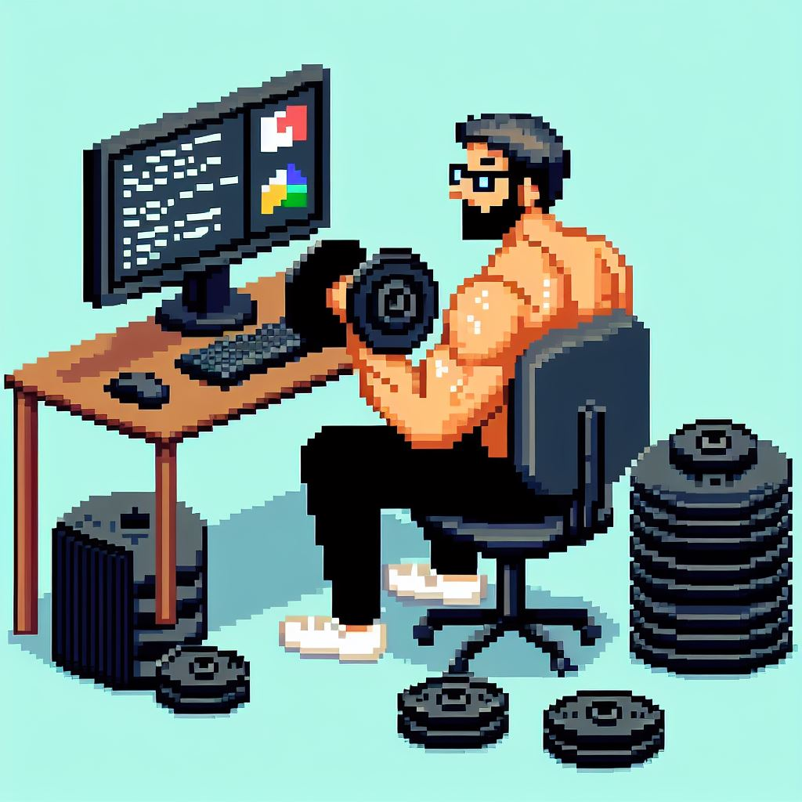

Mi nombre es:
# Cristian Emmanuel Gonzalez

```
import wollok.game.*
import obstaculos.*

object cristian { 
    var property *objetivosProfesionales* = ["Ser un profesional excepcional",
	"Nunca dejar de crecer", "Poder desarrollar proyectos independientes"]

    method nombre() = "Mi nombre es Cristian Gonzalez"
    
    method lugar() = "Soy de la localidad de Ituzaingó"

    method oficio() = "Trabajo de Entrenador Fitness" 

    method hobbies() = ["Entrenamiento", "Videojuegos", "Música"]
    
    method perseverante(){
	return "Cuando la vida me presenta obstáculos hago hasta lo imposible
	para abatirlos y seguir adelante, tratando de superarme día a día"
}

object life{
	method iniciar(){
		game.title("La vida de Cristian")
		
    	game.addVisualCharacter(cristian)
    	
    	game.addVisual(obstaculos)
    	
    	game.whenCollideDo(player, {obstaculos => game.say(player, player.perseverante())})
    	
        game.start()
    }
}
```


## Un poco de mi historia
A los 18 años luego de terminar la secundaria empecé la Ingeniería en Informática en la Universidad de La Matanza,
cursé un año completo y la abandoné porque se me hizo muy pesada y aburrida, hice muchos cursos diferentes en la U.T.N.
pero apliqué muy poco de lo aprendido a nivel profesional (principalmente Desarrollo Web). Desde chico me gusta mucho la
música, toco la guitarra, incluso tuve una banda de rock durante unos 7 años.
En el ámbito profesional me dedico al Fitness hace 8 años aproximadamente, trabajo en gimnasios, doy clases a domicilio,
y me encanta, pero mis ambiciones laborales van más allá.
Tengo muchos amigos y conocidos que se dedican a distintas ramas de la informática, y durante años recibí una y otra vez
la sugerencia de que debo estudiar programación, y a principio de 2023 lo hice, empecé en UNAHUR, con mil miedos e inseguridades
por mi edad, peleando contra todos los demonios que siempre aparecen para desalentarnos, logré superar todas mis expectativas
ampliamente, con mucho esfuero y perseverancia encontré que me apasiona mucho más de lo que hubiera imaginado, y hoy, con
una parte del camino ya transitada, tengo cada día más ganas.

## Redes:
- [x] [Instagram](https://www.instagram.com/cris_lovefit/)
- [x] [Instagram Lovefit](https://www.instagram.com/lovefit_ok/)
- [x] [Discord](#cris_lovefit)
- [x] [Discord Server](https://discord.gg/Cs243DdcYV)
